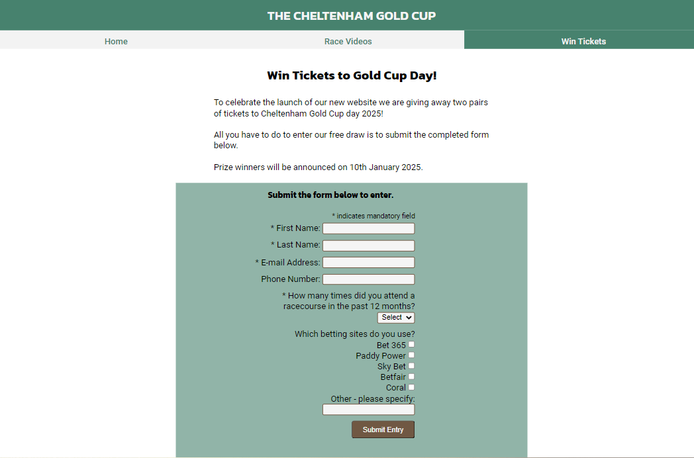
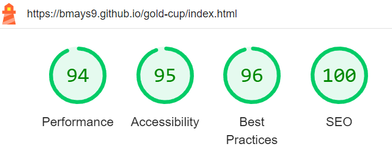
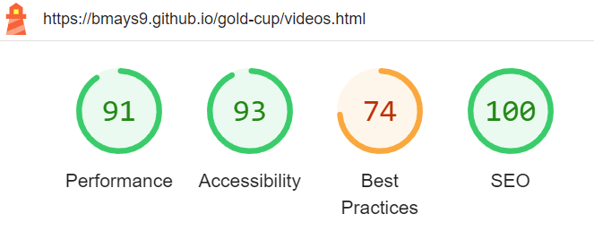

# The Cheltenham Gold Cup

View the live website [here](https://bmays9.github.io/gold-cup/index.html)

This page is for horse racing fans and celebrates the Cheltenham Gold Cup, a horse race run annually at the Cheltenham festival. The website provides users with race information, results, videos and useful links for those wishing to attend the next race.  

This site is targeted for horse racing fans who have knowledge of the Cheltenham Gold Cup.

## User Expectations

- The website should be easy to navigate and information is structured intelligently.
- The website shall be compatible to devices of all screen sizes with a responsive design.
- All images shall be optimised.
- Video content shall not autoplay on any page.
- The website shall use a consistent style of colourings and fonts across all pages.
 
## Colours

The colour scheme for the website was chosen to be simple and aligned with the familiar colours associated with horseracing - green and brown. 

## Typography

I have chosen to use Kanit from Google fonts for the headers and Roboto for the main text. I wanted a clean and simple font for the main body text with a second font to add some more interesting style to the main page header and section headings.

## Features

- __Search Engine Optimisation__
  - I used meta tags in the head of each page which are both relevant to the site and adjusted for the content of each specific page. These descriptions and keywords will improve the optimisation, ranking and traffic to the website. 

- __Navigation Bar__
  - Present at the top of all pages to give a consistent feel across the site. The navigation bar fills the width of the screen and the active page is highlighted in a different colour to help the user navigate the site. 

- __About Section__
  -  A photograph with a list of race features side by side at the top of the main page to grab the users attention and show immediately what the page is about. A short paragraph underneath explains more about the race and what resources the website provides.
 
 

- __Next Renewal (2025)__
  This section looks ahead to the next renewal of the race, providing information about the date and time, location with information about ticket offers and links to the official site to purchase them. Looking ahead to the race itself a link is provided for users to view the latest race odds. The section is 

- __Latest Result (2024)__
  This section provides the full race result of the 2024 renewal. The winning horse is featured most prominently in the centre of the page, with the second and third place horses shown underneath with silver and bronze medals for their respective placing.  The remainder of the result is displayed in a clean way to make it visually appealing on all screen sizes. The Distance column is hidden on smaller screen sizes to keep the visual appearance clean while retaining the most important information to the user.

- __Footer__
The footer provides a consistent image across all pages and provides the user information of how to follow the website creator on social media. The X logo is visible and it's presence gives the user confidence 
  - 

- __Race Videos__
  - This page presents the user with the race videos for a number of previous renewals. The videos are embedded from Youtube and displayed with a brief description of that race. The videos contain user controls and are not automatically played when the page loads.
  - 

 - __Competition__
   - This page offers users a chance to win tickets to attend the next race. The user is given instructions to complete and submit the form to enter, and details of how and when they will be notified if they win. 
  - 
  
    - The form contains input validation to ensure the user has submitted data in the mandatory fields.
        - First Name: Mandatory field, minimum 2 characters.
        - Last Name: Mandatory field, minimum 2 characters.
        - Email: Mandatory, must contain '@' and '.' characters.
        - Phone Number: Optional, if entered must contain minimum 

 - __Competition Entry__
   - This page confirms to the user that they have successfully completed the form and have entered the competition. 

### Features for future development

The following features will be added to the page in future:
  - In the next race section of the main page, the latest betting odds will be displayed on the page rather than via a link to an external site.
  - A poll will be available to users to vote on who they think will win the next race.
  - A page will be added for race trends, showing users all the relevant statistics from previous renewals.

## Technologies Used

Github: For version control, site hosting and for deployment.\
VS Code: The IDE I used to wrote my code, commit and push changes to Github.\
Code Institute: I used the Code Institute template to initiate the project in Github.\
HTML 5: Coding language used for my website.\
CSS: Used to style my website.\
Javascript: Use to import Font Awesome kit.\
DevTools: Used for testing my sire at all stages of the project.\
Google Fonts: Imported Kalit and Roboto fonts to style my website.\
Font Awesome: Used for all icons on the website main pages.\
Favicon: Used to import the icons for use in the title only.\
Pexels: All pictures were sourced from Pexels and are free to use.\
TinyPNG: Used to compress images for website optimisation.\
CloudConverter: Used to convert images to PNG and Webp format.\
W3C Markup Validation Service - used to validate HTML code.\
W3C CSS Validation Service - used to validate CSS code.\
Chrome Lighthouse - used to generate Lighthouse reports.\
WAVE Accessibility tool - used to assess accessibility.\
Amiresponsive.co.uk - used for responsive design example screenshots for this readme file.\
freeformatter.com - used for formatting html and css code.\
webaim.org - used to check colour contrasts for accessibility.\
htmlcolorcodes.com - used for colour code screenshots for readme.\

## Testing

### Validator Testing

1. WC3 HTML Validator used to validate the HTML 5 code written on all pages of my website - no errors or warnings found.\
 

2. Jigsaw CSS Validator used to validate the CSS code written for my website - no errors or warnings found.\
- 

3.  Google Chrome's Lighthouse Developer Tool used to analyse the performance and accessibility measures of my website.\

- Index page:
- 

- Videos page:
- 

- Win Tickets page:
- 

- Competition Entry / Form submission page:
- 

4. WAVE Accessibility Tool

The website has been fully checked with the WAVE tool and passed validation with no errors. I used alt tags on all images and aria-labels. 

### Device Testing

The website was tested by users on the following devices:
- Samsung Galaxy S8, Chrome
- Iphone 13 Mini, Chrome, Safari
- Ipad Air, Chrome, Safari
- Windows Desktop, Chrome, Edge

### Manual Testing

- Index page
  - All internal links should take the user to the correct page.
    - Pass
  - All external links should take the user to the correct website in a new tab.
    - Pass
  - Results table 'Dist' column should become visible on larger screens.
    - Pass
- Videos page
  - All videos should be displayed but none should autoplay.
    - Pass
  - User should have full control of all videos via an embedded interface.
    - Pass
  - User should be able to make videos play in full screen mode.
    - Pass
- Tickets page
  - Empty form should display error when submit button pressed.
    -  Pass
  - If any mandatory field is left empty an error should be displayed when submit button pressed.
    - Pass
  - Dropdown options should contain correct range of values.
    -  Pass
  - User should receive visual confirmation of their entry when form is completed successfully.
    - Pass
   
## Bugs and Fixes

- When testing the link for form submission I was expecting the entered.html page to be displayed. Instead an HTTP Error 405.0 - Method Not Allowed error was displayed.
  - The 'most likely causes' text on the error page proved to be helpful in finding the solution. I was still using method="post" in the form element tag. Changing this to method="get" fixed the issue.
  - 

- The Nav bar element would have inconsistent height when the mouse hovered over an anchor element.
   - The cause of this was discovered to be that the Nav bar had a height of zero and the anchor elements were extending beyond the limits.
   - The fix was to introduce a height parameter for the Nav bar.
   - 
  
      
## Deployment

I deployed my website early on Github pages.

### How to deploy the project

1. Log into Github
2. Go to the project repository.
3. In the Code and Automation section, select Pages.
4. Ensure Source = Deploy from Branch, Main Branch is selected, Folder = /(root).
5. Save deployment.
6. Go back to the Code tab, after a few minutes refresh the repository.
7. Click View Deployment to see the live site.

### How to clone the project

1. Log into Github
2. Go to the project repository at (https://github.com/bmays9/gold-cup)
3. Click on the Code button and copy your preferred link.
4. Open the terminal in your code editor and change the working directory to the location you want to use for the cloned directory.
5. Type 'git clone' into the terminal, paste the link you copied and hit enter.

## How to fork the repository

1. Login to Github
2. Go to the project repository at (https://github.com/bmays9/gold-cup)
3. Click the 'Fork' button.

## Credits and References

Makeuseof.com: Used for colour gradient suggestions.\
Code Institute Love Running project walkthrough: Consulted this project for screen size defaults for responsive design.\
Code Institute Love Running project walkthrough: Used the initial commit for the first HTML structure.\
https://stackoverflow.com/questions/5440657/how-to-hide-columns-in-html-table: Helped with code for hiding the table column in results section.\
https://teamtreehouse.com/community/how-to-center-just-the-content-and-stretch-the-blue-background!: Helped with justifying text in the About results section.\
https://github.com/kb5991/film-quiz/blob/main/README.md: Used as an example ReadMe file for reference on structure and content.\
https://www.sportinglife.com/racing/results/2024-03-15/cheltenham/777267/boodles-cheltenham-gold-cup-chase-grade-1-gbb-race: Race results and information taken from Sporting Life website.\
You Tube: Provided content and iframe code for race replays on the Video page.\

## Acknowledgements

I would like to thank my mentor Harry Dhillon for his encouragement and feedback throughout the project. His eye for detail has been a valuable resource and I am grateful for his input and suggestions. 

